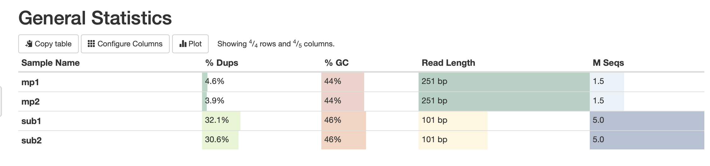
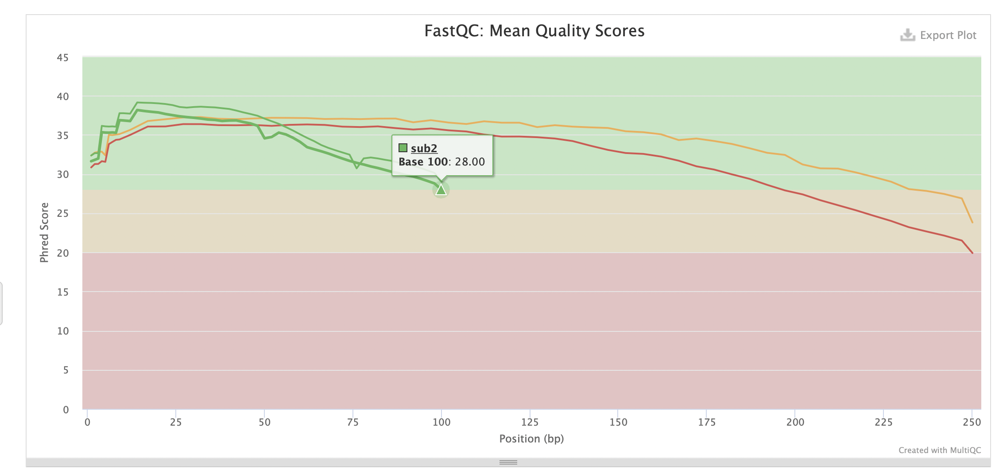
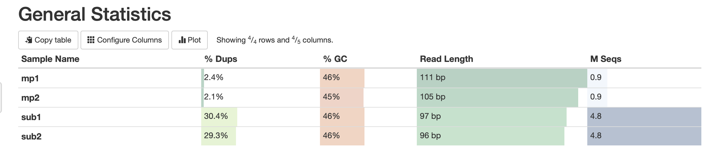
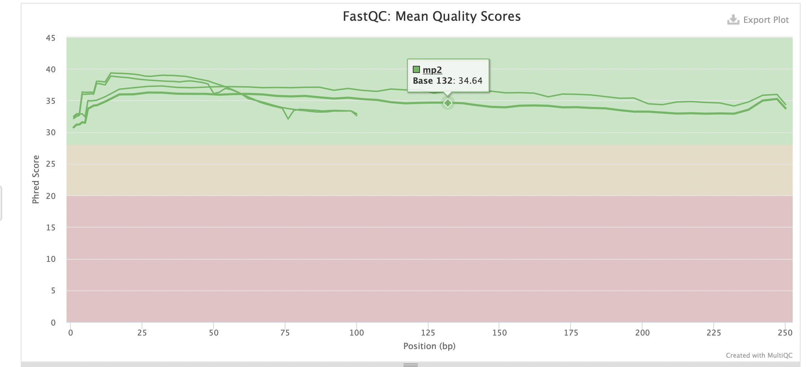

# hse22_hw1

**Копируем к себе файлы**:

ln -s /usr/share/data-minor-bioinf/assembly/

**Выбираем случайные чтения**:

seqtk sample -s819 ./assembly/oil_R1.fastq 5000000 > sub1.fastq

seqtk sample -s819 ./assembly/oil_R2.fastq 5000000 > sub2.fastq

seqtk sample -s819 ./assembly/oilMP_S4_L001_R1_001.fastq 1500000 > mp1.fastq

seqtk sample -s819 ./assembly/oilMP_S4_L001_R2_001.fastq 1500000 > mp2.fastq

**Оценка чтений FastQC**:

mkdir fastqc

ls *.fastq | xargs -P 4 -tI{} fastqc -o fastqc {}

**Создания отчета одним файлом MultiQC**:

mkdir multiqc

multiqc -o multiqc fastqc

**Подрезаем чтения**:

platanus_trim sub1.fastq sub2.fastq

platanus_internal_trim mp1.fastq mp2.fastq

mkdir trimmed_fastq

mv -v *.trimmed trimmed_fastq

**Оценка качества обрезанных чтений FastQC**:

mkdir trimmed_fastqс
ls trimmed_fastq/* | xargs -P 4 -tI{} fastqc -o trimmed_fastqс {}

**Создания отчета одним файлом обрезанных чтений MultiQC**:

mkdir multiqc_trimmed

multiqc -o multiqc_trimmed fastqc_trimmed

**Сбор контигов**:

time platanus assemble -o Poil -f sub1.fastq.trimmed sub2.fastq.trimmed 2> assemble.log

**Сбор скаффолдов**:

time platanus scaffold -o Poil -c Poil_contig.fa -IP1 trimmed/sub1.fastq.trimmed trimmed/sub2.fastq.trimmed -OP2 trimmed/mp1.fastq.int_trimmed trimmed/mp2.fastq.int_trimmed 2> scaffold.log

**Заполнение гэпов**:

time platanus gap_close -o Poil -c Poil_scaffold.fa -IP1 /trimmed/sub1.fastq.trimmed trimmed/sub2.fastq.trimmed -OP2 /trimmed/mp1.fastq.int_trimmed trimmed/mp2.fastq.int_trimmed 2> gapclose.log

**Начальные данные**

**После выполнения обрезания**

Как можно видеть данные стали лучше и с меньшим количеством дупликатов. 
Также привожу результаты из папки src:

**Контиги**

Общее кол-во контигов: 615 

 Их общая длина: 3925685 

 Длина самого длинного контигов: 179304 

 N50: 55043

**Скаффолды**

 Общее кол-во скаффолдов: 68 

 Их общая длина: 3873780  

 Длина самого длинного скаффолда: 3831846  

 N50: 3831846 

 **Гэпы до заполнения**

 Количество последовательностей N: 62 

 Общее количество N: 6710

  **Гэпы после заполнения**

  Количество последовательностей N: 8 
  
 Общее количество N: 1892